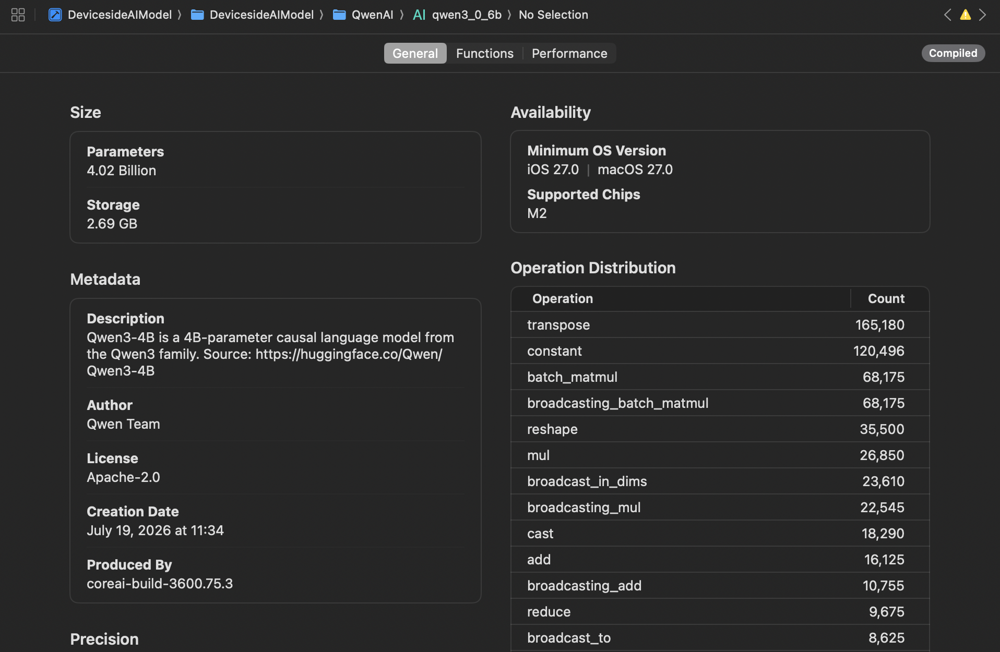
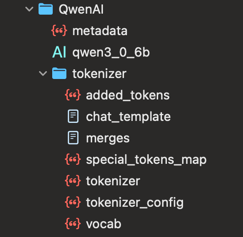
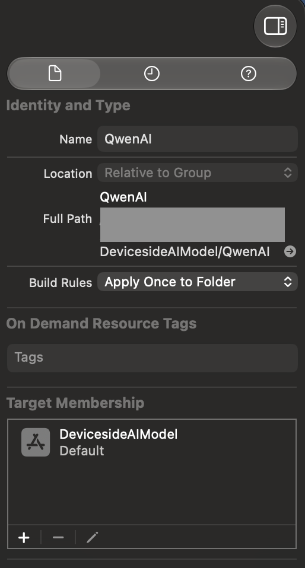

## 模型准备

> [!Important]
>
> 请务必按照本文要求自行准备模型
>
> 使用Qwen3-4B作为演示，可自行更换其它模型

### 准备环境和模型

首先，需要注意安装Metal Toolchain：这个在Xcode - Setting中安装即可。在项目中，添加[coreai-models](https://github.com/apple/coreai-models)这个Swift Package，将`CoreAILM` Labrary添加到你的App Target中。

现在项目中就有coreai-models了，终端进入到这个Package的文件夹，执行：
```shell
uv run coreai.llm.export Qwen/Qwen3-4B --platform iOS
```
这将会从Hugging Face上下载Qwen3-4B模型，并针对iOS特殊化转换成`.aimodel`文件，同时产生一个专用的元数据和tokenizer。

> 你也可以下载其它模型。具体使用方法coreai-models项目中models这个文件夹内的各个模型的说明。

在得到这3个文件（夹）后，我们需要对`.aimodel`进行一下预编译。这里要注意一下：`.aimodel`可以直接不处理，放到项目中；但是这样会导致每次启动时间变长，而且模型会在每次启动时进行特殊化编译到磁盘，浪费时间也浪费储存空间。至于每次启动都会重复编译的问题，这似乎是Bug。

我在这里很推荐对每种架构进行事前编译，这样也能提高运行效率：
```Shell
xcrun coreai-build compile MyModel.aimodel --platform iOS --min-deployment-version 27.0 --output compiled/
```
运行后会在compiled文件夹中产生11个架构（数量可能会不同）的.aimodelc文件，每个文件的命名遵循`MyModel.<arch>.aimodelc`的格式。其中`<arch>`为架构名称，可通过`AIModel.deviceArchitectureName`在设备中获取。一般情况下，模型不随着App Bundle分发，都是根据deviceArchitectureName在后端请求对应的文件下载。当然，你也可以导出指定架构，添加`--architecture <arch>`即可。

针对架构编译后的模型（M2）：


为了演示，这里我们直接将对应架构的模型文件直接放入Bundle中。将下载下来的3个文件/文件夹放到一个文件夹内（注意用上一步的`.aimodelc`替换`.aimodel`文件，然后同时更改`metadata.json`中的`assets.main`为`.aimodelc`文件的名称），拖入项目工程中。注意需要设置Bundle Rule为`Apply Once to Folder`，同时设置Target Membership。这样整个文件夹就会复制到Bundle中了。





### 代码调用

首先，我们需要将这个模型文件夹载入进来。从Bundle中获取文件夹的URL

```Swift
let folderPath = Bundle.main.path(forResource: "QwenAI", ofType: nil)!
let folderURL = URL(fileURLWithPath: folderPath)
```

随后，从模型文件夹加载大语言模型：

```Swift
model = try await CoreAILanguageModel(resourcesAt: folderURL)
try await model.load()
```
其中`load()`会将模型读取到内存中，这会比较大。首次运行时会再针对设备产生特殊化模型文件并保存到App的沙盒。这一步时间通常会比较长

加载后，我们用这个模型初始化一个Session：
```Swift
session = LanguageModelSession(model: model, instructions: "你是一个xxx助理...") // 参数详情参见Foundation Model的Document
```
这样我们就可以调用了。`LanguageModelSession`是Foundation Model里的一个类。它和使用内置的模型用法是一样的。可以使用`@Generable`宏或者直接调用输出。例如：
```Swift
session.respond(to: "你好").content

// 或者流式输出
session.streamResponse(to: msg)
```
这一部分不再赘述，可参考文档或WWDC视频。

### 运行
这里需要说明一下，运行时需要使用Release环境，不要使用Debug环境。Debug环境下速度会比较慢